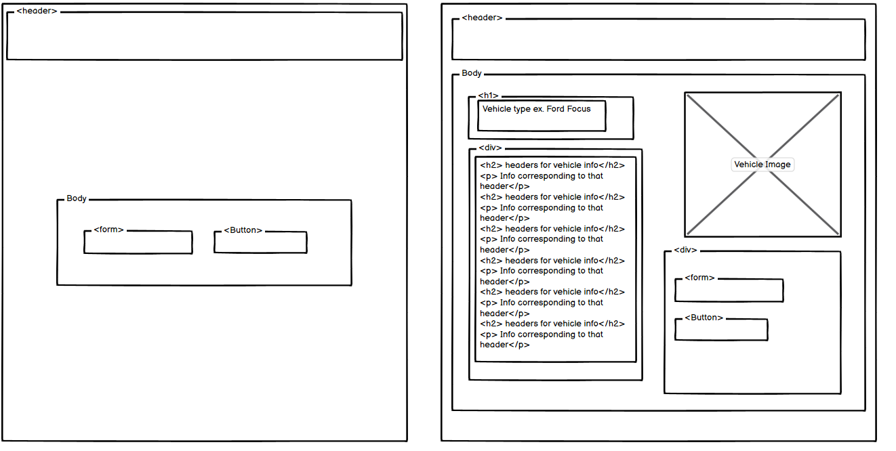
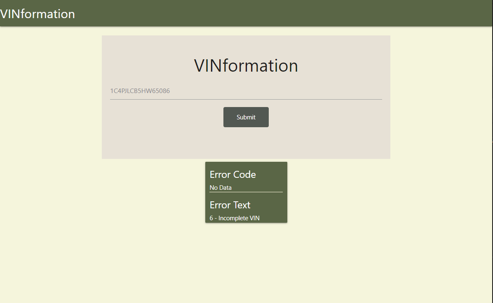
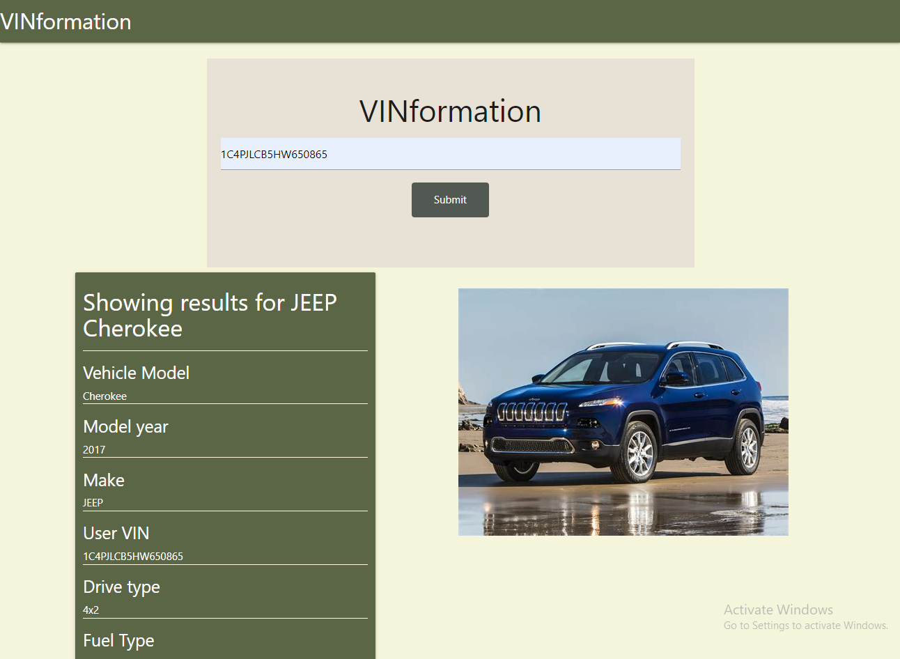

# Project-1
Title: VINformation
Authors: Clayton Abel, Sahana Dinesh, Austin Stoppenhagen, Lizbett Rivera
Published: [Github](https://clabel95.github.io/Project-1/)
Link: [Repository](https://github.com/clabel95/Project-1)

The purpose of this assignment was to utilize our newly aquired skills and create a front-end web application from scratch. The group came together to ensure our web application solved a real world problem by intergrating data received from two different server-side APIs. VINformation is a web application that may be used to search a vehicle by inputting a VIN number and receiving information about it. The informaton retured includes the vehicle model, model year, make, user vin, drive type, fuel type, engine cylinders, engine horsepower, seats, top speed, vehicle type, and an image of the vehicle. 


## Wireframe 


## Input VIN


## Bad VIN


## Good VIN and results



## JS and API calls
```md
The JavaScript can be split into three sections.


The first section is at the top of the page. In this section we are defining all the variables that we will be using both internaly as well as retrieving id's from the html that we will be dynamicly updating. 


The second section of the JS are the two event listeners.
The first event listener is checking for page refresh. When the page is refreshed the all of the containers are set to display: none. This is done to make the page cleaner and not cluttered.
The second event listener is the submit button that takes whatever text the user has input and passes it into the third section. 


The third and final section is where the JS file does its API calls and updates data based on the results of the API calls. The first API call is the VIN number. If the VIN is not input correctly then the JS displays the errors that are returned from the api for the user to see. If the VIN is input correctly then all of the information related to the VIN will be populated in the table. If the API has missing information for parts of the table then instead "no data" will be displayed for that section. After that then vehicles year, model, and make will be passed to the second API call. The second API call is an image search API. This api will populate the image src in the html with an image that matches the year make and model of the users input VIN.
```


